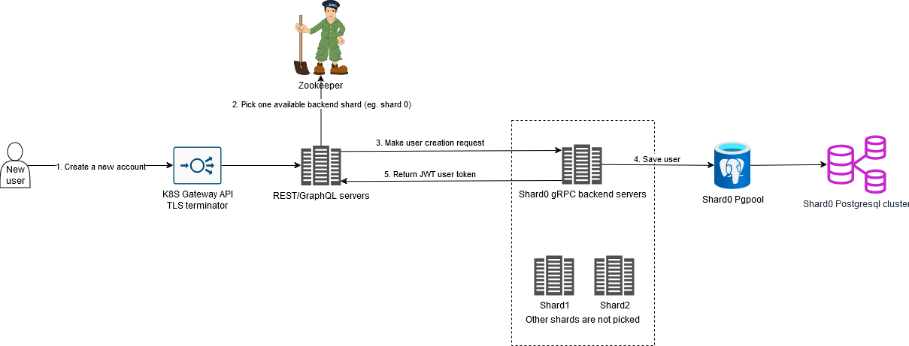
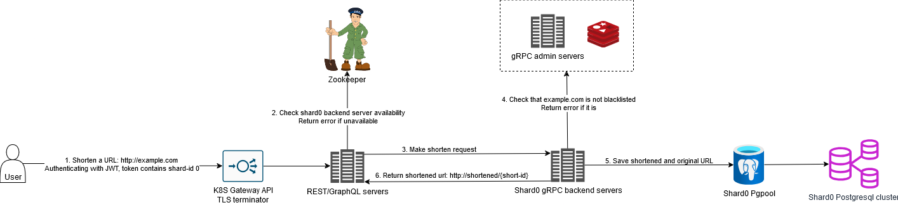
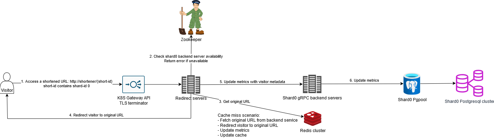
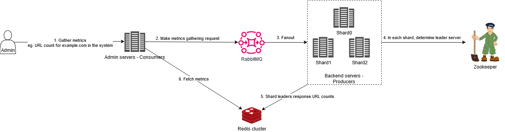

# Scalable URL Shortener Service

## Overview

This project is about designing a scalable URL shortener like bit.ly. Objectives:

- **CI/CD:** Use GitHub Action workflows to build container images and Helm charts, then deploy updates with ArgoCD.
- Create short links for long URLs that redirect to the original when clicked.
- Links don't expire unless users delete them.
- Block URLs on a blacklist from being shortened.
- Track visits: daily/weekly/monthly/all-time stats, origin countries, user agents, browsers, OS, referrers, etc.
- Rate limit requests to prevent abuse.
- Use OpenTelemetry for distributed tracing so developers can debug with tools like Jaeger. Export metrics to
  OTLP-compatible services, Prometheus operator can detect via ServiceMonitors.
- Use Zookeeper for service health checks, live configurations and shard leader elections.
- Offer both REST and GraphQL APIs for users to pick how they want to access their data.
- Internal communication between services happens via gRPC (unicast) and RabbitMQ (multicast), secured with Istio's
  mutual TLS.
- Use DNS client-side load balancing for gRPC.
- Terminate frontend TLS with Istio Ingress Gateway.
- Handle ACME-issued and self-signed certificates with cert-manager and trust-manager.

## High-Level Design

- **Frontend:** Stateless frontend services behind Kubernetes gateways for TLS termination.
- **Backend:** Sharded backend system with Redis caching to reduce DB load, Pgpool middleware for database load
  balancing.
- The following shows use-cases from 3 perspectives, the users who use the service, the visitor who visit the short
  links to the original long URLs, and the admins.

### User Flow

- A user signs up/logs in and get a short-lived JWT token. This token includes the shard-id, so the system knows which
  shard they belong to.



- Use REST or GraphQL APIs to create short links and check stats.



### Visitor Flow

- When someone clicks a short link, its short-id contains the shard-id. The system uses that to fetch the original URL.



### Admin Flow

- Admins can blacklist domains (applies to all shards).
- They can gather system-wide metrics using RabbitMQ as the message broker.

- 

## Shortening Algorithm

- Uses **Base62 encoding** to create short links (~3.5 trillion combos with 7 characters).
- Starts with a big number like 100000000000 (Base10), which encodes to Base62 as 1L9zO9O.
- Increments the counter by 1 for each new short link to ensure uniqueness.
- Thanks to @sandeep4.verma for outlining how this works in
  his [article](https://medium.com/@sandeep4.verma/system-design-scalable-url-shortener-service-like-tinyurl-106f30f23a82).

Examples:

- Shortening: 100000000000 → 1L9zO9O
- Expanding: 1L9zO9O → 100000000000

## Sharding and Scaling

- Each backend shard manages its own SQL database.
- Counter ranges are assigned per shard (e.g., 1–10M on one shard, 10M–20M on the next).
- Default counter starts at 100000000000. When one server's range is almost full, admins can spin up a new instance with
  its own range.

## How to build and deploy

### Prerequisites

- cert-manager is required to handle self-signed certs.

```bash
helm install cert-manager bitnami/cert-manager --version 1.3.22 \
  --set controller.resourcesPreset=none --set webhook.resourcesPreset=none --set cainjector.resourcesPreset=none \
  --set installCRDs=true \
  --set controller.extraArgs[0]="--enable-certificate-owner-ref" \
  --namespace cert-manager --create-namespace
```

### Deploy shared services

```bash
NAMESPACE=default
echo "PREFIX=shortener
REDIS_PASSWORD=password
RABBITMQ_PASSWORD=password01234567
RABBITMQ_ERLANG_COOKIE=password0123456789abcdefghijklmn" > shared-credentials.env
kubetpl render manifests/shortener-shared/credentials.tpl -i shared-credentials.env > shared-credentials.unsealed.yaml
kubeseal --cert kubeseal-cert.pem --format yaml -n $NAMESPACE < shared-credentials.unsealed.yaml > shared-credentials.sealed.yaml
kubectl create -f shared-credentials.sealed.yaml -n $NAMESPACE
helm install shortener-shared manifests/shortener-shared -n $NAMESPACE --render-subchart-notes
```

### Deploy admin service

- The admin and backend services are deployed as headless so the gRPC clients can use client-side DNS load balancing.

```bash
NAMESPACE=default
echo "PREFIX=shortener-admin
ADMIN_USER=admin
ADMIN_PASSWORD=password
POSTGRES_PASSWORD=password
REPMGR_PASSWORD=password
PGPOOL_PASSWORD=password" > admin-credentials.env
kubetpl render manifests/shortener-admin/credentials.tpl -i admin-credentials.env > admin-credentials.unsealed.yaml
kubeseal --cert kubeseal-cert.pem --format yaml -n $NAMESPACE < admin-credentials.unsealed.yaml > admin-credentials.sealed.yaml
kubectl create -f admin-credentials.sealed.yaml -n $NAMESPACE
helm install shortener-admin manifests/shortener-admin -n $NAMESPACE --render-subchart-notes
```

### Deploy backend service (shard 0)

```bash
NAMESPACE=default
PREFIX=shortener-backend
SHARD_ID=0
echo "PREFIX=$PREFIX
SHARD_ID=$SHARD_ID
JWT_ISSUER=shortener.localcert.net
JWT_AUDIENCE=shortener.localcert.net
JWT_SECRET_KEY=password0123456789abcdefghijklmn
POSTGRES_PASSWORD=password
REPMGR_PASSWORD=password
PGPOOL_PASSWORD=password" > backend$SHARD_ID-credentials.env
kubetpl render manifests/shortener-backend/credentials.tpl -i backend$SHARD_ID-credentials.env > backend$SHARD_ID-credentials.unsealed.yaml
kubeseal --cert kubeseal-cert.pem --format yaml -n $NAMESPACE < backend$SHARD_ID-credentials.unsealed.yaml > backend$SHARD_ID-credentials.sealed.yaml
kubectl create -f backend$SHARD_ID-credentials.sealed.yaml -n $NAMESPACE
helm install $PREFIX$SHARD_ID manifests/shortener-backend --set shardId=$SHARD_ID -n $NAMESPACE --render-subchart-notes
```

### Deploy frontend services

```bash
NAMESPACE=default
PREFIX=shortener-frontend

# ACME (optional)
ACME="$(cat your_acme_api_key.json)"
kubetpl render manifests/shortener-frontend/credentials.tpl -s PREFIX=$PREFIX -s ACME="$ACME" > frontend-credentials.unsealed.yaml
kubeseal --cert kubeseal-cert.pem --format yaml -n $NAMESPACE < frontend-credentials.unsealed.yaml > frontend-credentials.sealed.yaml
kubectl create -f frontend-credentials.sealed.yaml -n $NAMESPACE

helm install shortener-frontend manifests/shortener-frontend -n $NAMESPACE
```

### Debug build

- No HA, just deploy the bare minimum for debugging.

```bash
helm install shortener-shared manifests/shortener-shared -f manifests/shortener-shared/debug-values.yaml
kubectl port-forward svc/shortener-shared-zookeeper 10000:2181
kubectl port-forward svc/shortener-shared-rabbitmq 10001:5672
kubectl port-forward svc/shortener-shared-redis-master 10002:6379

helm install shortener-admin manifests/shortener-admin -f manifests/shortener-admin/debug-values.yaml
kubectl port-forward svc/shortener-admin-postgresql 10003:5432
kubectl port-forward svc/shortener-admin 10004:5001

helm install shortener-backend0 manifests/shortener-backend -f manifests/shortener-backend/shard0-debug-values.yaml
kubectl port-forward svc/shortener-backend0-postgresql 10005:5432
kubectl port-forward svc/shortener-backend0 10006:5001

helm install shortener-frontend manifests/shortener-frontend -f manifests/shortener-frontend/debug-values.yaml
kubectl port-forward svc/shortener-frontend-rest 10007:5000
kubectl port-forward svc/shortener-frontend-graphql 10008:5000
kubectl port-forward svc/shortener-frontend-redirect 10009:5000
```

- Uninstall

```bash
helm uninstall shortener-frontend
helm uninstall shortener-backend0
helm uninstall shortener-admin
helm uninstall shortener-shared
kubectl delete pvc -l app.kubernetes.io/name=zookeeper
kubectl delete -f frontend-credentials.sealed.yaml
kubectl delete -f backend0-credentials.sealed.yaml
kubectl delete -f admin-credentials.sealed.yaml
kubectl delete -f shared-credentials.sealed.yaml
```

### ArgoCD example deployment

```bash
argocd app create -f argocd-app-of-apps.yaml
```
